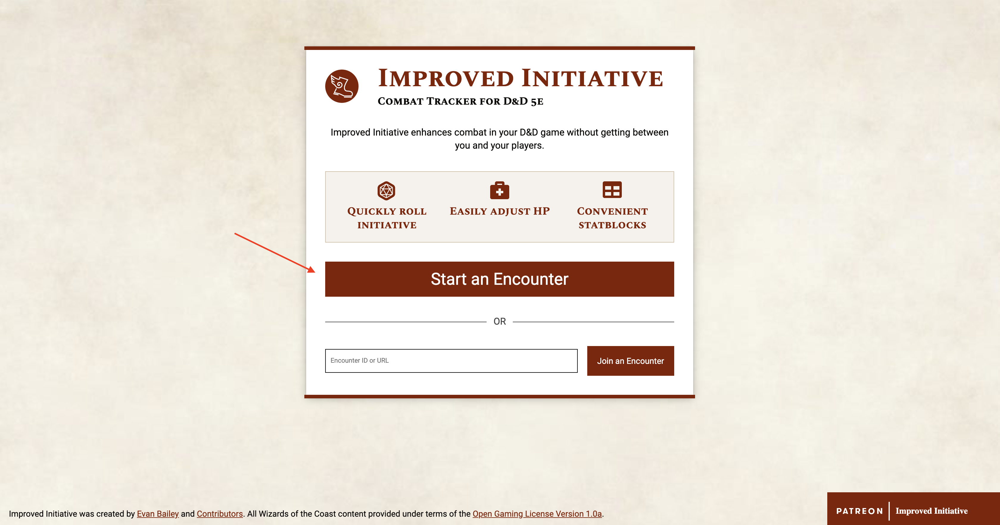
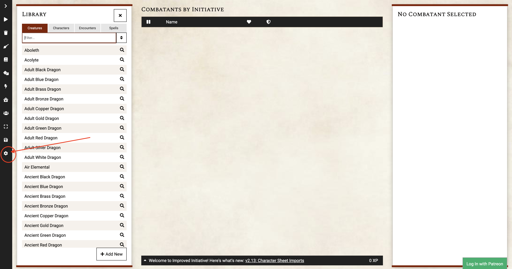
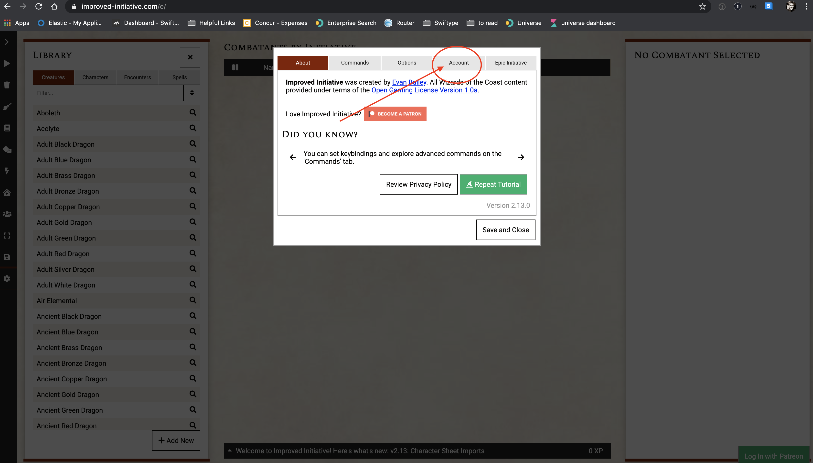
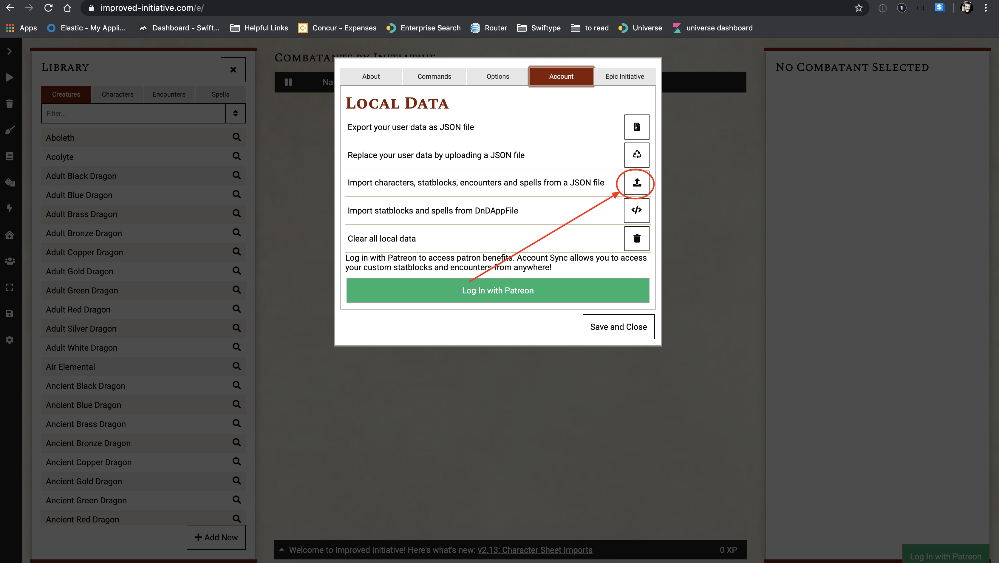
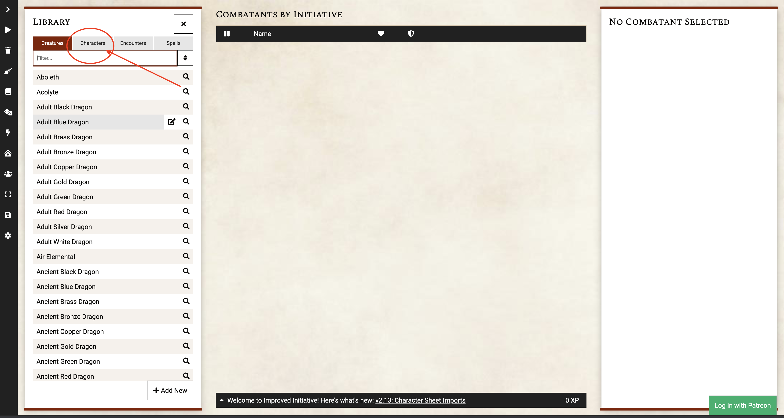
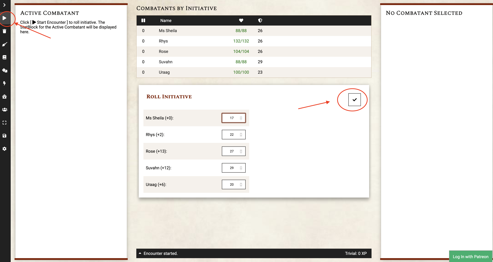
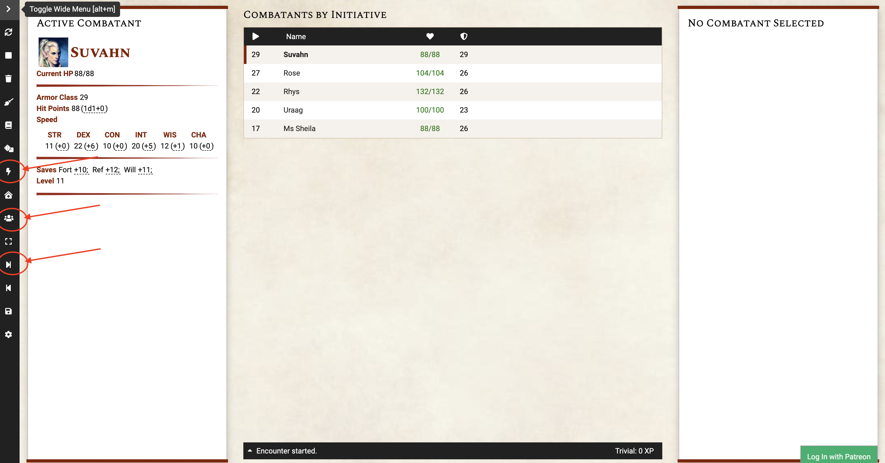
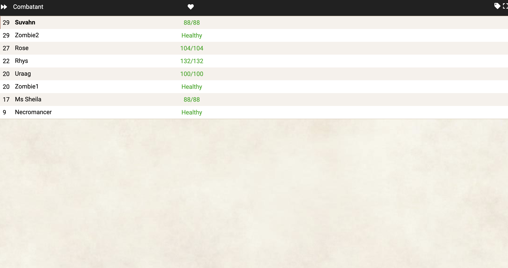

# This is Why - Initiative
For Improved Initiative tracking.

You'll find this repo has a single JSON file. This file is used for https://www.improved-initiative.com

### Setup
1. Visit https://www.improved-initiative.com and click `Start an Encounter` 
2. Click on the Settings gear 
3. Click on the `Account` tab 
4. Click on the `Import characters, statblocks, encounters, and spells from a JSON file` button 
5. Select the `improved-initiative.json` file included in this repo
6. Click on the `Characters` tab of the `Library` 
7. Click on each character to add them as a combatant
8. On the left, click the "play" button to start the encounter. This will bring up a dialog showing what was "rolled" for initiative. If everything looks good, click the check mark to start! 
9. Combat has begun! To add bad guys, click the lightning bolt! To share the link to the "player view", click the people! To move to the next in the order, click the arrow! 

In case you were worried, the player view doesn't show any NPC stats, but gives a general idea of "health"
